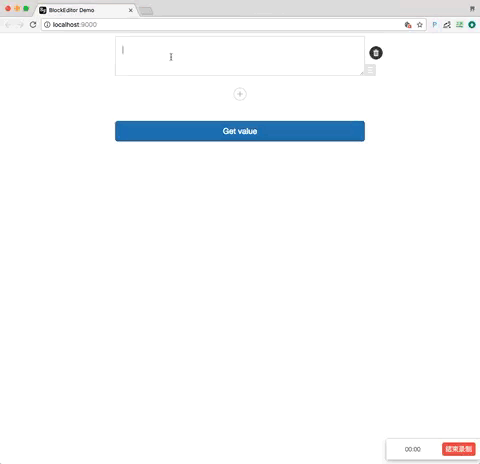
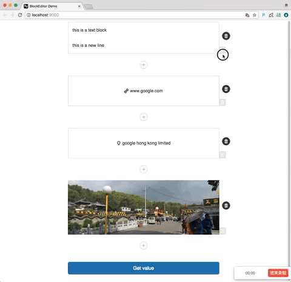

Block-Editor is a react component that is used to compose articles.




For an article, it can be seperated to `blocks`, these blocks can be moved around, reorder, added, deleted,
at last time, when author finish composing, he can get an array of blocks.

Block-editor support four types of blocks

* text: an autoresize textarea
* photo: you can select image files from local folder, it will be converted to base64 data
* link: a url text
* location: a location map, after search keywords, you can select a Poi. For now, map provider is [amap](https://lbs.amap.com/api/javascript-api/summary/)

### Features

* support multiple block types: text, photo, link, location.
* drag and drop to re-order blocks.
* add & del blocks.
* edit blocks in place.
* nice icons :-)

This repo is a demo app, which shows the usage of block-editor component.

### Usage

App.js

``` javascript
import React from 'react';
import ReactMixin from 'react-mixin';
import LinkedImmutableStateMixin from 'reactlink-immutable';

import styles from '../styles/App.css';
import BlockEditor from './blockeditor/BlockEditor';


export default class App extends React.Component {
    constructor() {
        super();
        this.state = {
            model: {
                body: []
            }
        }
    }

    componentWillReceiveProps(nextProps) {
    }

    componentDidMount() {
        this.componentWillReceiveProps(this.props);
    }

    getValue() {
        let body = this.state.model.body;
        console.log(this.refs.body_ref.getDecoratedComponentInstance().normalizeBody(body));
    }

    render() {
        let model = this.state.model;
        return (
            <div className="App">
                <BlockEditor ref="body_ref" body={model.body} />
                <button onClick={this.getValue.bind(this)}> Get value </button>
            </div>
        )
    }
}

App.propTypes = {
    model: React.PropTypes.object
};

ReactMixin(App.prototype, LinkedImmutableStateMixin);

```

Some notes:

* give BlockEditor a ref `body_ref`, so we can reference this component.

    but this ref is refering a `DragDropContext` component,
    we have to use `getDecoratedComponentInstance` to get the inner `BlockEditor` component.

* model.body is a array object.

    which means every modifications on `body` in `BlockEditor` will effect out to our `model.body`.
    it's just what we want, we need to know what happened inside `BlockEditor` and get its value.

    CAUTION: it's data reference, not data copy. Maybe I will change it to data copy someday.

The api `normalizeBody(body)` will validate the body content, such as `text` block should contains some text,
`link` block must contains url, `photo` block must be ready.

### Output

After all valid, this api will give the result like bellow json array:

```json

[
    {
        "type": "text",
        "text": "this is another ↵↵textarea."
    }, {
        "type": "photo",
        "photo": "data:image/jpeg;base64,/9j/.............."
    }, {
        "type": "link",
        "link": {
            "url": "this is another ↵↵textarea."
        }
    }, {
        "type": "place",
        "place": {
            "id": "B0FFF5SSEY",
            "name": "Google上海cafe",
            "aal1": "上海市",
            "aal2": "上海市",
            "aal3": "黄浦区",
            "country": "中国",
            "tel": "none",
            "address": "西藏中路268号来福士广场16楼(近福州路)",
            "location": {
                "la": 31.232369,
                "lng": 121.476707
            }
        }
    }
]

```
